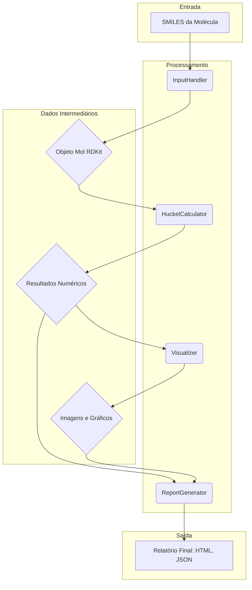
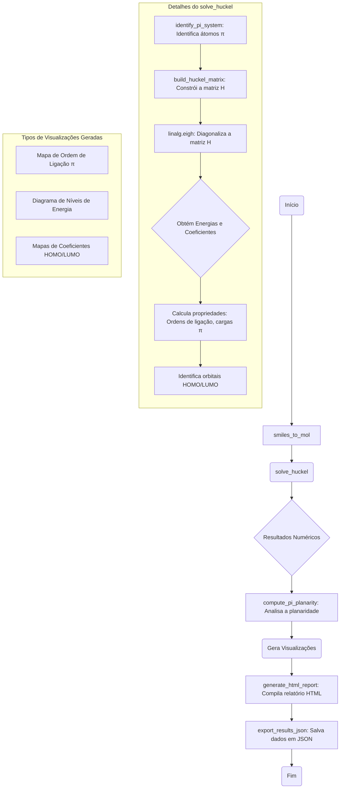

# **Implementação do Método de Hückel para Moléculas Conjugadas**

## **Resumo**

Este projeto apresenta uma implementação computacional do **Método de Hückel** para a análise de sistemas de elétrons π em moléculas orgânicas conjugadas.
O objetivo principal é fornecer uma **ferramenta didática** para estudantes de graduação em **Química e Física**, permitindo:

* Cálculo dos **níveis de energia** dos orbitais moleculares (OMs).
* Determinação dos **coeficientes dos OMs**.
* Visualização de propriedades eletrônicas fundamentais, como:

  * **HOMO** (*Highest Occupied Molecular Orbital* – Orbital Molecular Ocupado de Mais Alta Energia).
  * **LUMO** (*Lowest Unoccupied Molecular Orbital* – Orbital Molecular Desocupado de Mais Baixa Energia).

O código constrói a **matriz de Hückel**, resolve o **problema de autovalores** para obter energias e orbitais e gera **diagramas e relatórios detalhados**.

---

## **Pré-requisitos**

Para executar este projeto, é necessário ter **Python 3.x** instalado, juntamente com as seguintes bibliotecas:

* **Python 3.10+**
* **NumPy**: cálculos numéricos e manipulação de matrizes.
* **Matplotlib**: geração de gráficos e diagramas de energia.
* **RDKit**: manipulação de estruturas moleculares e identificação de sistemas π.

---

## **Instalação das Dependências com Conda**

A instalação via **conda** é fortemente recomendada, pois gerencia a complexa dependência da biblioteca RDKit de forma eficiente.

### **1. Criar e ativar um novo ambiente Conda**

```bash
conda create -c conda-forge -n huckel_env python=3.10 rdkit numpy matplotlib
```

### **2. Ativar o ambiente**

```bash
conda activate huckel_env
```

---

## **Como Executar**

O projeto foi desenvolvido como um **pipeline autocontido** no script `huckel_pipeline.py`.
Para executá-lo, rode no terminal (com o ambiente Conda ativado):

```bash
python huckel_pipeline.py
```

A execução do script principal ativará uma função de demonstração (`demo_pipeline`), que realizará o cálculo para a **molécula de benzeno** como exemplo.

---

## **Arquivos Gerados**

Após a execução, será criado um diretório chamado **`demo_output/`**, contendo:

* **Relatório HTML (.html)**: relatório completo com diagramas, tabelas de energia, ordens de ligação e mapas de orbitais de fronteira.
* **Imagens (.png)**:

  * Diagrama de níveis de energia dos orbitais moleculares.
  * Visualização dos coeficientes dos orbitais HOMO e LUMO sobre a estrutura molecular.
  * Mapa de ordens de ligação π.
  * Estrutura molecular com a numeração dos átomos do sistema π.
* **Dados JSON (.json)**: arquivo com resultados numéricos (energias, coeficientes, etc.) para fácil processamento.

---

## **Estrutura do Projeto**

O projeto está concentrado em um único arquivo principal para simplicidade:

* **`huckel_pipeline.py`**:

  * **Classes principais**:

    * `MoleculeConfig`, `Results`: manipulação de dados.
    * `HuckelCalculator`: lógica do método (construção e diagonalização da matriz).
    * `Visualizer`: geração de gráficos e imagens.
    * `ReportGenerator`: criação de relatórios em HTML e JSON.
    * `QuantumChemistryPipeline`: orquestra o fluxo completo.

---

## **Funcionalidades Principais**

* **Construção da Matriz de Hückel**: geração automática a partir da topologia molecular identificada via RDKit.
* **Cálculo de Autovalores e Autovetores**: diagonalização da matriz para obter energias e coeficientes dos OMs.
* **Análise dos Orbitais de Fronteira**: identificação de **HOMO**, **LUMO** e cálculo do **gap de energia**.
* **Propriedades Eletrônicas**: cálculo de ordens de ligação π e densidades de carga π.
* **Visualizações e Relatórios**: gráficos interativos em HTML, incluindo diagramas de níveis e mapas de orbitais.

---

## **Diagramas de Fluxo**

### **Arquitetura do Pipeline (Interação entre Componentes)**



---

### **Fluxo de Execução do Cálculo (`run_single_calculation`)**



---

## **Etapas de Visualização**

* **Mapa de Ordem de Ligação π** (`plot_bond_order_overlay`): sobrepõe as ordens de ligação π na estrutura 2D.
* **Diagrama de Níveis de Energia** (`plot_orbital_energy_diagram`): exibe níveis, HOMO, LUMO e gap.
* **Mapas de Coeficientes HOMO/LUMO** (`plot_huckel_mo_on_molecule`): desenha orbitais sobre a molécula.

---

## **Exemplo de Uso**

```python
from huckel_pipeline import QuantumChemistryPipeline, MoleculeConfig

# 1. Inicializar o pipeline
pipeline = QuantumChemistryPipeline(output_dir="meus_calculos")

# 2. Definir a molécula (SMILES do benzeno)
molecula_benzeno = MoleculeConfig(smiles="C1=CC=CC=C1", name="benzeno")

# 3. Executar o cálculo
resultados = pipeline.run_single_calculation(molecula_benzeno)

# 4. Exibir resultados principais
if resultados.success:
    print(f"Cálculo para {resultados.molecule_name} concluído com sucesso!")
    print(f"Energia do HOMO: {resultados.homo_energy:.3f} eV")
    print(f"Energia do LUMO: {resultados.lumo_energy:.3f} eV")
    print(f"Gap HOMO-LUMO: {resultados.homo_lumo_gap:.3f} eV")
```

---

## **Referências Bibliográficas**

A teoria e os fundamentos aplicados neste projeto são discutidos em:

* **Levine, I. N.** *Quantum Chemistry* (7th ed.). Pearson, 2009.
